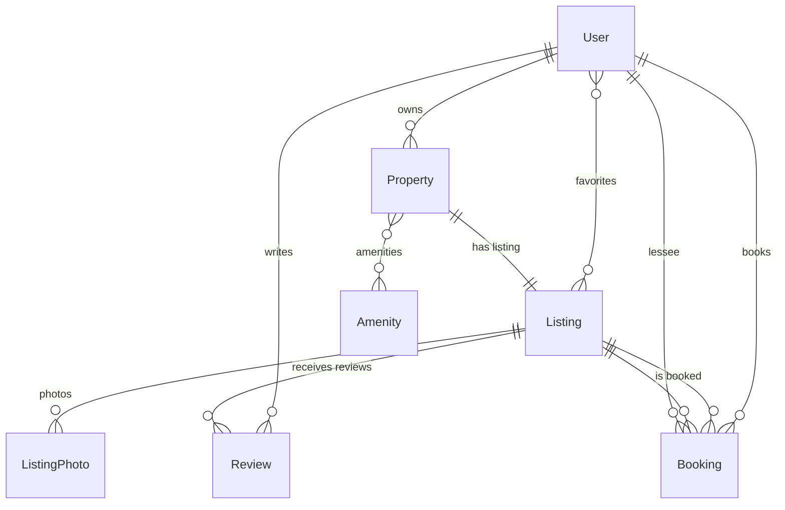

# Booking Service API

> Backend platform for rental booking: users create listings, guests book them, leave reviews, and background tasks automatically update booking statuses.

[](https://www.python.org/)
[](https://www.djangoproject.com/)
[](https://www.django-rest-framework.org/)
[](https://docs.celeryq.dev/)

## Table of Contents

- [About](#about)
- [Key Features](#key-features)
- [Tech Stack](#tech-stack)
- [Architecture](#architecture)
- [Quick Start](#quick-start)
  - [With Docker (recommended)](#with-docker-recommended)
  - [Locally without Docker](#locally-without-docker)
- [Environment Variables](#environment-variables)
- [API](#api)
- [Authentication](#authentication)
- [Celery and Background Tasks](#celery-and-background-tasks)
- [Management Commands](#management-commands)
- [Data Models](#data-models)
- [Project Structure](#project-structure)
- [Development](#development)
- [Deployment](#deployment)

---

## About

**Booking Service API** is a REST API for a rental booking service (a miniature Booking/Airbnb). The project implements the full booking lifecycle: from a property owner creating a listing to automatically marking a booking as "ended" after the guest checks out.

The backend is built with **Django 6.1.1** and **Django REST Framework 3.18.1**. It features **JWT authentication**, **soft delete** for critical entities, **Celery background tasks**, **filtering via django-filter**, and **OpenAPI auto-documentation (Swagger/Redoc)**.

---

## Key Features

- **Custom user model** with email-based authentication, email verification, avatar, and favorite listings.
- **Create and manage listings** for rental properties (houses, apartments, communal flats).
- **Flexible listing filtering** by city, lodging type, price, amenities, and more.
- **Booking lifecycle**: `requested → reserved → occupied → ended` (or `canceled`).
- **Automatic booking status updates** via Celery Beat, every hour.
- **Reviews and ratings** (1–5 stars), with a "one review per user per listing" constraint.
- **Soft delete** for users and properties — records are not physically removed.
- **Pagination** (10 items per page) and **JWT tokens** with revocation support (blacklist).
- **Interactive API documentation** (Swagger UI and Redoc).

---

## Tech Stack

| Category | Technology |
|---|---|
| Language | Python 3.13 |
| Web framework | Django 6.1.1 |
| API | Django REST Framework 3.18.1 |
| Database | PostgreSQL 15 (Docker image: `postgres:15-alpine`) |
| Message broker | Redis 7 (`redis:7-alpine`) |
| Background tasks | Celery 5.6.3 + Celery Beat |
| Authentication | `djangorestframework-simplejwt` 5.5.1 |
| Filtering | `django-filter` 26.1 |
| API documentation | `drf-spectacular` 0.30.0 |
| Database driver | `psycopg` 3.3.5 (binary) |
| Test data generation | `Faker` 40.39.0 (`de_DE`) |
| Image handling | `pillow` 12.3.0 |
| Environment configuration | `django-environ` 0.14.0 |
| Containerization | Docker, Docker Compose |
| Web server | Gunicorn (in `Dockerfile`) + Nginx (reverse proxy) |
| Static analysis | `django-stubs`, `djangorestframework-stubs` |

---

## Architecture

The project is split into **six apps** inside the `apps/` package.

### `apps.core`
Base abstract models and shared utilities.

- `UniqueIDModel` — abstract model with a UUID primary key.
- `TimeStampModel` — abstract model with `created_at`, `updated_at`, `deleted_at` fields and a **manager with soft delete support**.
- `LodgingType` — `TextChoices` with lodging types: `house`, `apartment`, `communal`.

### `apps.users`
Custom user model.

- `User` inherits from `AbstractUser`, uses **email as `USERNAME_FIELD`**, and includes `phone_number`, `date_of_birth`, `bio`, `profile_photo`, `is_email_verified`, and `favorite_listings` (M2M to `Listing`).
- Custom `UserManager`.
- **Soft delete**: `delete()` sets `deleted_at`, while `hard_delete()` physically removes the record.

### `apps.properties`
Physical real estate.

- `Property` model: address (country, state, city, street, building, apartment/room), lodging type, room/bedroom/bathroom/kitchen counts, areas, **M2M to `Amenity`**, and `is_verified` flag (checked by admin).
- `Amenity` model — a reference list of amenities (Wi-Fi, washing machine, etc.).

### `apps.listings`
Public rental listings.

- `Listing` model: title, description, **OneToOne to `Property`**, price per night, max guests, minimum rental days, `is_active` flag, `views_count` counter.
- `ListingPhoto` model: listing photos with sequence numbers (unique pair `listing + photo_sequence_number`).

### `apps.bookings`
Bookings.

- `Booking` model: **FK to `Listing`** and **FK to `User` (lessee)**, `check_in`/`check_out` dates, status, `amount_paid`, comments from both parties.
- **Statuses**: `requested`, `reserved`, `canceled`, `occupied`, `ended`.
- DB constraint: `check_out > check_in`.
- Celery task `update_booking_statuses` automatically transitions bookings to `occupied`/`ended` based on dates.

### `apps.reviews`
Reviews.

- `Review` model: **FK to `Listing`** and **FK to `User` (commentator)**, text, `rating` (1–5).
- Unique constraint: one user — one review per listing.
- Database-level constraint.

### ER Diagram



---

## Quick Start

### With Docker (recommended)

1. **Clone the repository:**

   ```bash
   git clone https://github.com/illaay/booking-service-api.git
   cd booking-service-api
   ```

2. **Create `.env` from `.env.example`:**

   ```bash
   cp .env.example .env
   ```

   Edit `.env` as needed (see [Environment Variables](#environment-variables)).

3. **Build and start the containers:**

   ```bash
   docker compose up --build -d
   ```

   The following services will start: `db` (PostgreSQL), `redis`, `web` (Gunicorn), `celery_worker`, `celery_beat`, `nginx`.

4. **Apply migrations and collect static files:**

   ```bash
   docker compose exec web python manage.py migrate
   docker compose exec web python manage.py collectstatic --noinput
   ```

5. **Seed the database with test data (optional):**

   ```bash
   docker compose exec web python manage.py seed_database
   ```

6. **Verify the API is running:**

   - Swagger UI: [http://localhost/api/docs/](http://localhost/api/docs/)
   - Redoc: [http://localhost/api/redoc/](http://localhost/api/redoc/)
   - Admin panel: [http://localhost/admin/](http://localhost/admin/)

### Locally without Docker

1. **Create a virtual environment and install dependencies:**

   ```bash
   python -m venv .venv
   source .venv/bin/activate       # Linux/macOS
   # .venv\Scripts\activate        # Windows
   pip install -r requirements.txt
   ```

2. **Create `.env`** (similar to `.env.example`). Make sure `DB_HOST=localhost` and `DB_PORT=5432`.

3. **Start PostgreSQL and Redis** (locally or via Docker):

   ```bash
   docker compose up -d db redis
   ```

4. **Apply migrations and create a superuser:**

   ```bash
   python manage.py migrate
   python manage.py createsuperuser
   ```

5. **Run the development server:**

   ```bash
   python manage.py runserver
   ```

6. **Run Celery (in separate terminals):**

   ```bash
   celery -A config worker -l info
   celery -A config beat -l info
   ```

---

## Environment Variables

| Variable | Description | Example |
|---|---|---|
| `SECRET_KEY` | Django secret key | `your-secret-key-here` |
| `DEBUG` | Debug mode (`True`/`False`) | `False` |
| `ALLOWED_HOSTS` | Comma-separated list of allowed hosts | `*` or `example.com,www.example.com` |
| `DB_NAME` | PostgreSQL database name | `booking_db` |
| `DB_USER` | Database user | `booking_user` |
| `DB_PASSWORD` | Database password | `strong_password` |
| `DB_HOST` | Database host (`db` for Docker, `localhost` locally) | `db` |
| `DB_PORT` | Database port | `5432` |
| `CELERY_BROKER_URL` | Celery broker URL | `redis://redis:6379/0` |
| `CELERY_RESULT_BACKEND` | Celery result backend URL | `redis://redis:6379/0` |

All variables are loaded via `django-environ` from the `.env` file.

---

## API

Base URLs and main endpoints (based on `config/urls.py`):

| Prefix | Description |
|---|---|
| `/listings/` | Listings: CRUD, filtering, search |
| `/users/` | Users: registration, profile, favorites |
| `/properties/` | Properties |
| `/bookings/` | Bookings: create, cancel, change status |
| `/reviews/` | Reviews |
| `/login/` | Obtain JWT pair (access + refresh) |
| `/login/refresh/` | Refresh access token |
| `/logout/` | Revoke refresh token (blacklist) |
| `/api/schema/` | OpenAPI schema (JSON/YAML) |
| `/api/docs/` | Swagger UI |
| `/api/redoc/` | Redoc |

### Request Examples

**List listings with pagination:**

```bash
curl "http://localhost/listings/?page=1&city=Berlin"
```

Response:

```json
{
  "count": 25,
  "next": "http://localhost/listings/?page=2",
  "previous": null,
  "results": [
    {
      "id": "uuid...",
      "title": "Beautiful Apartment in Berlin",
      "price_per_night": "120.00",
      "property": {}
    }
  ]
}
```

**Create a booking (JWT required):**

```bash
curl -X POST "http://localhost/bookings/" \
  -H "Authorization: Bearer <access_token>" \
  -H "Content-Type: application/json" \
  -d '{
    "listing": "uuid...",
    "check_in": "2026-10-01",
    "check_out": "2026-10-05",
    "lessee_comment": "Arriving for a conference"
  }'
```

---

## Authentication

The project uses **JWT** (JSON Web Tokens) via `djangorestframework-simplejwt`.

### Obtaining a Token

```bash
curl -X POST "http://localhost/login/" \
  -H "Content-Type: application/json" \
  -d '{"email": "user@example.com", "password": "password123"}'
```

Response:

```json
{
  "access": "eyJ...",
  "refresh": "eyJ..."
}
```

### Usage

Pass the **access token** in the `Authorization` header:

```
Authorization: Bearer <access_token>
```

### JWT Settings (from `config/settings.py`)

| Parameter | Value |
|---|---|
| `ACCESS_TOKEN_LIFETIME` | 60 minutes |
| `REFRESH_TOKEN_LIFETIME` | 1 day |
| `ROTATE_REFRESH_TOKENS` | `True` |
| `BLACKLIST_AFTER_ROTATION` | `True` |
| `AUTH_HEADER_TYPES` | `('Bearer',)` |

Token revocation is handled by `rest_framework_simplejwt.token_blacklist`.

---

## Celery and Background Tasks

The project uses **Celery** for background tasks and **Celery Beat** for scheduled tasks.

### Configuration (from `config/celery.py`)

```python
app = Celery('rent_project')
app.config_from_object('django.conf:settings', namespace='CELERY')
app.autodiscover_tasks()

app.conf.beat_schedule = {
    'update-booking-statuses-every-hour': {
        'task': 'apps.bookings.tasks.update_booking_statuses',
        'schedule': crontab(minute=0),
    },
}
```

The **`update_booking_statuses`** task runs **every hour at minute 0** and performs:

1. **Check-in**: bookings with status `requested` or `reserved` whose `check_in` date has arrived (≤ today) are moved to `occupied`.
2. **Check-out**: bookings with status `occupied` whose `check_out` is strictly before today are moved to `ended`.

### Running

```bash
# Worker — executes tasks
celery -A config worker -l info

# Beat — scheduler
celery -A config beat -l info

# For development — both together (not for production!)
celery -A config worker -B -l info
```

Docker Compose runs `celery_worker` and `celery_beat` as separate services.

---

## Management Commands

### `seed_database`

Seeds the database with German-language test data (`de_DE`):

- 10 users (`user0@rent.de` … `user9@rent.de`, password `password123`);
- superuser `admin@rent.de` / `password123`;
- amenities (`Wi-Fi`, `Washing Machine`, etc.);
- properties in major German cities (Berlin, Munich, Hamburg, etc.);
- listings with photos;
- ended, current, and requested bookings;
- reviews.

**Usage:**

```bash
python manage.py seed_database
```

> **Warning:** the command uses `hard_delete()` for users with existing emails — be careful in production.

---

## Data Models

### `User` (`apps/users`)

| Field | Type | Description |
|---|---|---|
| `id` | UUID | Primary key |
| `email` | EmailField (unique) | Login, `USERNAME_FIELD` |
| `first_name` | CharField(50) | First name |
| `last_name` | CharField(50) | Last name |
| `phone_number` | CharField(16) | Phone number in international format |
| `date_of_birth` | DateField | Date of birth |
| `bio` | CharField(200) | Short bio |
| `profile_photo` | ImageField | Avatar |
| `is_email_verified` | BooleanField | Whether email is verified |
| `favorite_listings` | M2M → `Listing` | Favorite listings |
| `deleted_at` | DateTimeField | Soft delete marker |

### `Property` (`apps/properties`)

| Field | Type | Description |
|---|---|---|
| `owner` | FK → `User` | Owner |
| `is_verified` | BooleanField | Verified by admin |
| `country`, `state`, `city`, `street`, `building` | CharField | Address |
| `apartment_number`, `room_number` | CharField | For apartments/rooms |
| `lodging_type` | CharField (choices) | `house`, `apartment`, `communal` |
| `total_rooms_count` | PositiveIntegerField | Total rooms (3–10) |
| `bedrooms_count` | PositiveIntegerField | Bedrooms (1–8) |
| `bathrooms_count` | PositiveIntegerField | Bathrooms (1–3) |
| `kitchens_count` | PositiveIntegerField | Kitchens (1–3) |
| `total_area` | DecimalField | Total area |
| `living_area` | DecimalField | Living area |
| `amenities` | M2M → `Amenity` | Amenities |

### `Listing` (`apps/listings`)

| Field | Type | Description |
|---|---|---|
| `title` | CharField(100) | Title (min 5 chars) |
| `description` | TextField(1000) | Description |
| `property` | OneToOne → `Property` | Related property |
| `price_per_night` | DecimalField | Price per night |
| `max_guests` | PositiveIntegerField | Max guests |
| `min_rental_days` | PositiveIntegerField | Minimum rental days |
| `is_active` | BooleanField | Visibility |
| `views_count` | PositiveIntegerField | View count |

### `Booking` (`apps/bookings`)

| Field | Type | Description |
|---|---|---|
| `listing` | FK → `Listing` | Listing |
| `lessee` | FK → `User` | Renter |
| `check_in` | DateField | Check-in date |
| `check_out` | DateField | Check-out date |
| `status` | CharField (choices) | `requested`, `reserved`, `canceled`, `occupied`, `ended` |
| `amount_paid` | DecimalField | Amount paid |
| `lessor_comment` | TextField(300) | Owner's comment |
| `lessee_comment` | TextField(300) | Guest's comment |

DB constraint: `check_out > check_in`.

### `Review` (`apps/reviews`)

| Field | Type | Description |
|---|---|---|
| `listing` | FK → `Listing` | Listing |
| `commentator` | FK → `User` | Author |
| `review` | TextField(500) | Review text |
| `rating` | PositiveIntegerField | Rating (1–5) |

Unique constraint: `(listing, commentator)`.

---

## Project Structure

```
booking-service-api/
├── apps/
│   ├── bookings/          # Bookings
│   ├── core/              # Abstract models, shared utilities
│   ├── listings/          # Rental listings
│   ├── properties/        # Real estate properties
│   ├── reviews/           # Reviews
│   └── users/             # Custom user model
├── config/
│   ├── __init__.py        # Imports celery_app
│   ├── asgi.py
│   ├── celery.py          # Celery configuration
│   ├── settings.py        # Django settings
│   ├── urls.py            # Root URL configuration
│   └── wsgi.py
├── .dockerignore
├── .env.example           # Environment variables template
├── .gitignore
├── Dockerfile             # Image for web, celery_worker, celery_beat
├── deploy.sh              # Deployment script for a clean server
├── docker-compose.yml     # Orchestration: db, redis, web, celery, nginx
├── manage.py
├── nginx.conf             # Reverse proxy configuration
└── requirements.txt
```

---

## Development

### Code Style

The project uses **type hints** (`django-stubs`, `djangorestframework-stubs`). Follow **PEP 8** and write docstrings in **Google style**.

### Migrations

```bash
python manage.py makemigrations
python manage.py migrate
```

### Tests

A testing framework is not yet configured. `pytest` + `pytest-django` are planned.

### Adding a New App

1. Create a folder under `apps/`.
2. Add the app to `INSTALLED_APPS` in `config/settings.py`.
3. Wire up URLs in `config/urls.py` via `include()`.

---

## Deployment

The repository includes a **`deploy.sh`** script that automates deployment on a clean Ubuntu server:

1. Installs Docker and Docker Compose.
2. Configures a swap file (1 GB).
3. Clones the repository.
4. Copies `.env`.
5. Builds and starts the containers.
6. Applies migrations, collects static files, runs `seed_database`.
7. Brings all services up.

**Usage:**

```bash
./deploy.sh
```

> Before running, make sure a `.env` file with valid values exists in the current directory.

### Nginx

Nginx is configured as a reverse proxy:

- `/static/` → serves static files from `/fma/static/`
- `/media/` → serves media files from `/fma/media/`
- `/ping/` → returns `404` (for healthcheck)
- `/` → proxies to `http://web:8000`

---

## Author

**illaay** — [GitHub](https://github.com/illaay)
